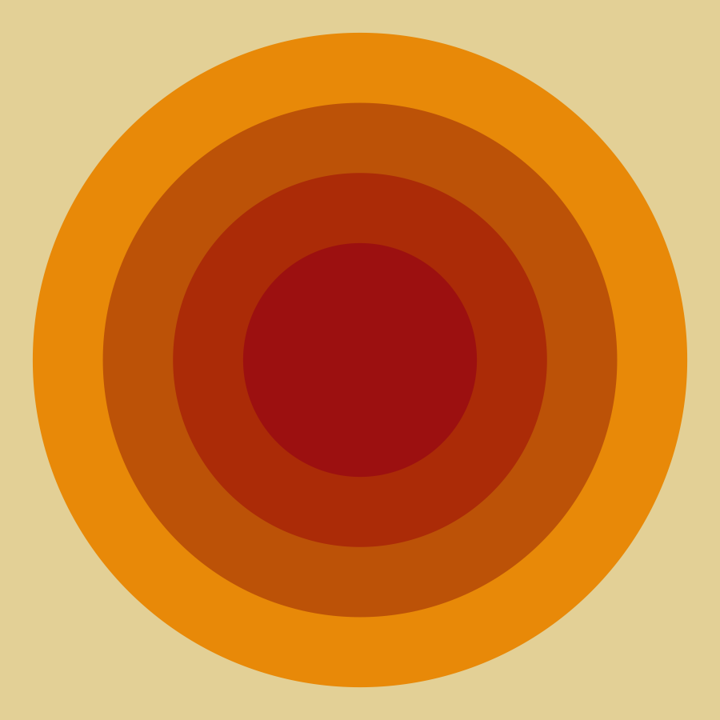
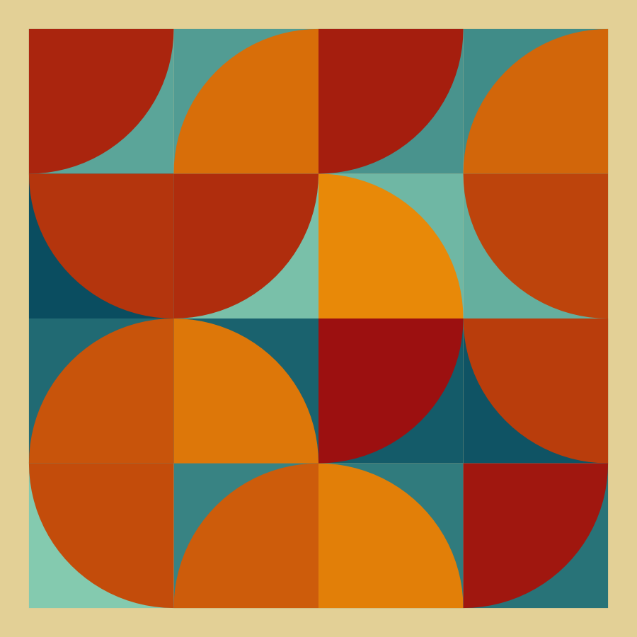
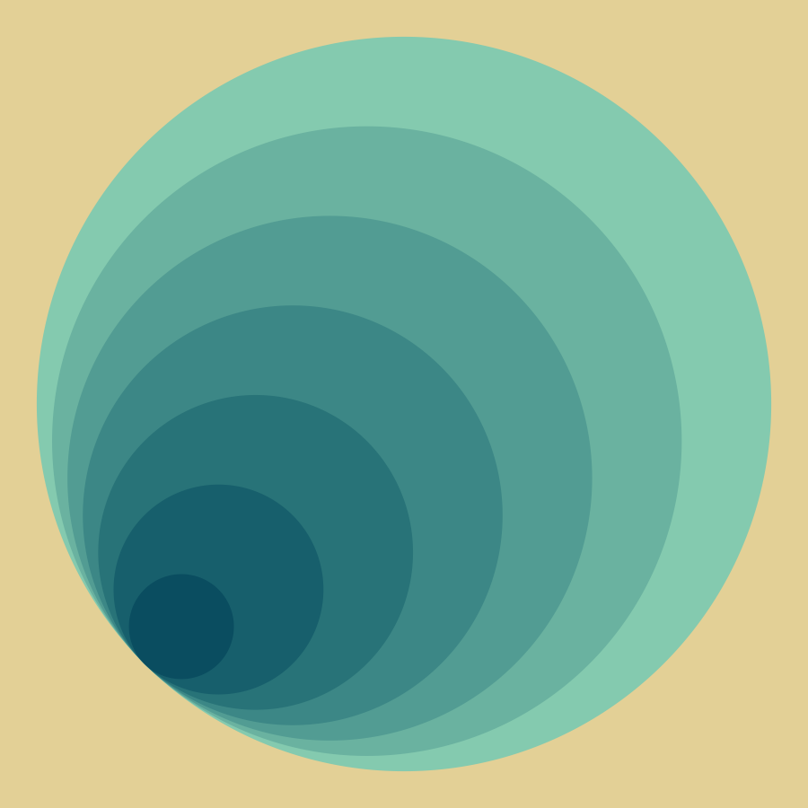
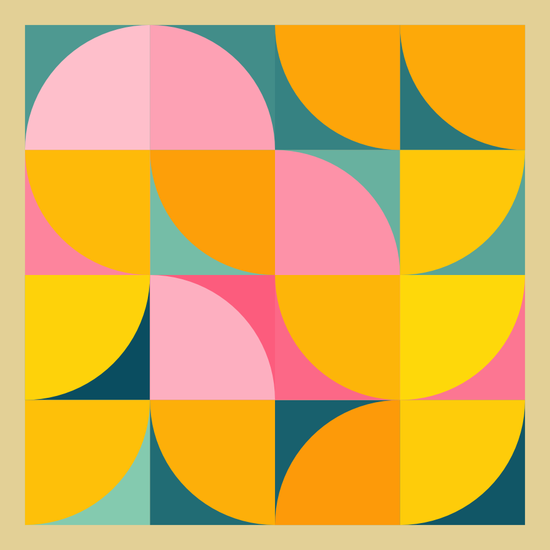
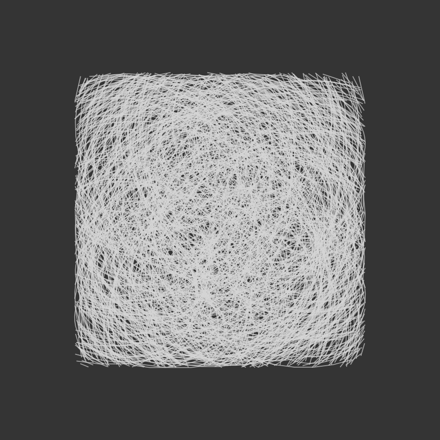
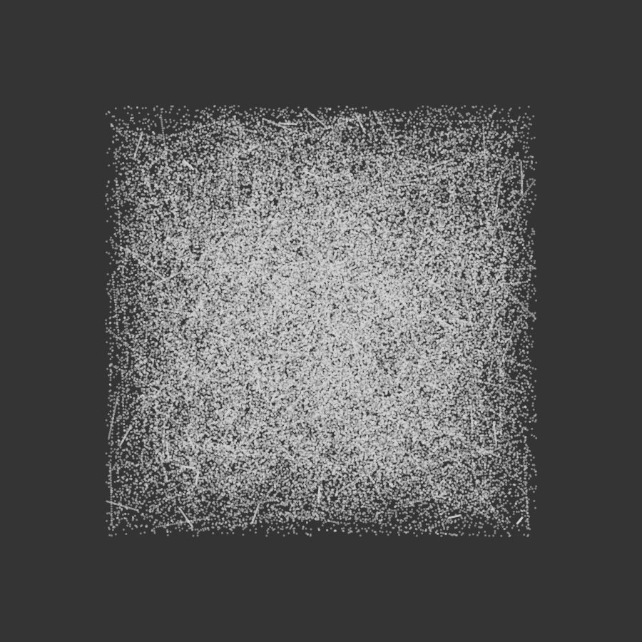

<!-- badges: start -->

<!-- badges: end -->

This repository contains code I've used to create art using R [(#rtistry)](https://twitter.com/search?q=%23rtistry&src=typed_query). As the title suggests, I start by choosing a theme and then explore different outputs until I'm satisfied. By the nature of this process, the code in this repository will always be a work in progress. The images below are examples of outputs from the code included here.  

You are welcome to use this code to recreate the outputs, or as a starting point for writing your own code to create more art. If you enjoy this and would like to let me know, or have any questions, please get in contact [@ShandiyaB](https://twitter.com/ShandiyaB).  


### radial  

```{r radial-img, echo = FALSE, message=FALSE, warning=FALSE, fig.show="hold", out.width=c('33%', '33%','33%')}
knitr::include_graphics("images/radial_jitter.png")
knitr::include_graphics("images/radial_line.png")
knitr::include_graphics("images/radial_step.png")
```  

### bauhaus

```{r bauhaus_img, echo = FALSE, message=FALSE, warning=FALSE, fig.show="hold", out.width=c('25%', '25%','25%', '25%')}




```  

### twirly-whirly

```{r tw-img, echo = FALSE, message=FALSE, warning=FALSE, fig.show="hold", out.width=c('33%', '33%','33%')}
knitr::include_graphics("images/tw1.png")


```  

### texture

```{r texture_img, echo = FALSE, message=FALSE, warning=FALSE, fig.show="hold", out.width=c('50%', '50%')}


```  

