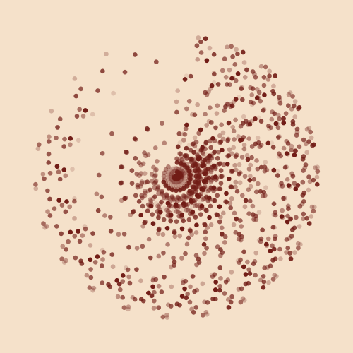
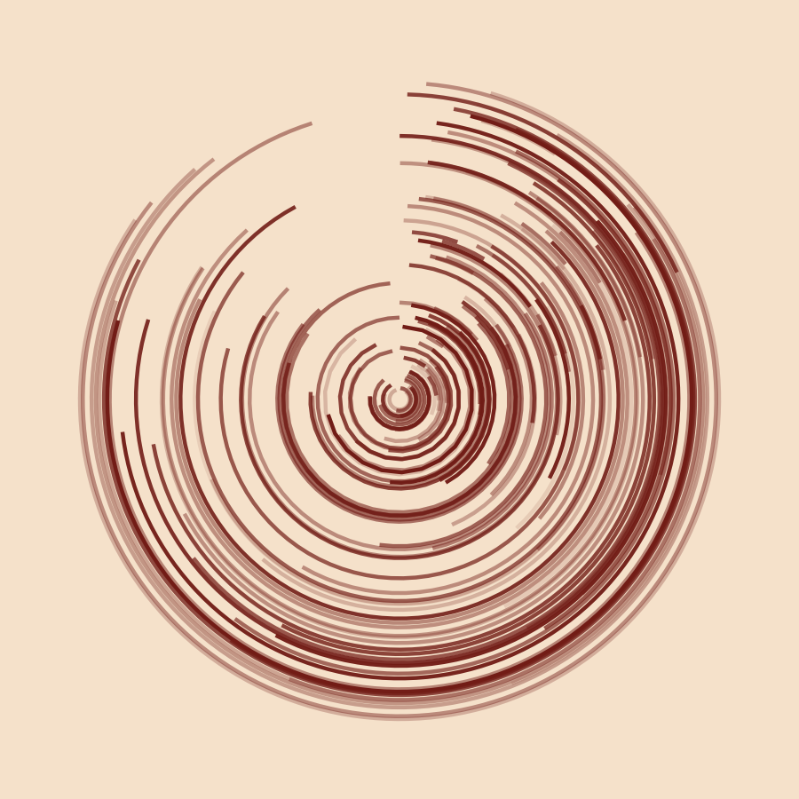
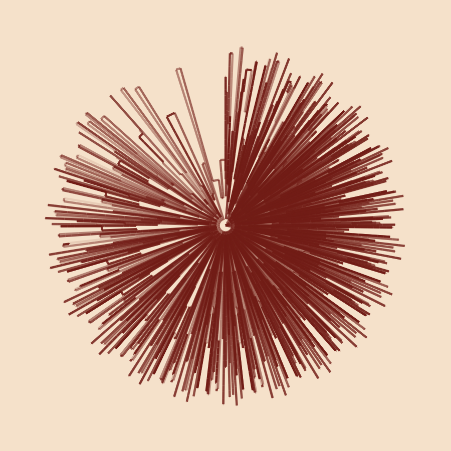

# variations-on-a-theme

This repository contains code I've used to create art using R [(#rtistry)](https://twitter.com/search?q=%23rtistry&src=typed_query). As the title suggests, I start by choosing a theme and then explore different outputs until I'm satisfied. By the very nature of this process, the code in this repository will always be a work in progress. If you enjoy this and would like to let me know, or have any questions, please get in contact [@ShandiyaB](https://twitter.com/ShandiyaB).  

  
   
  

