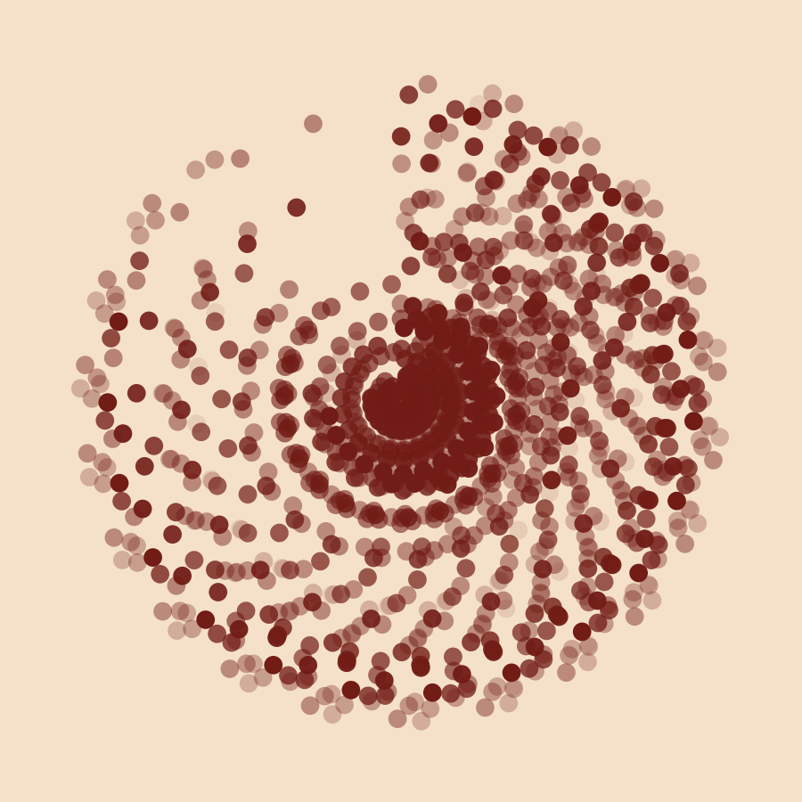
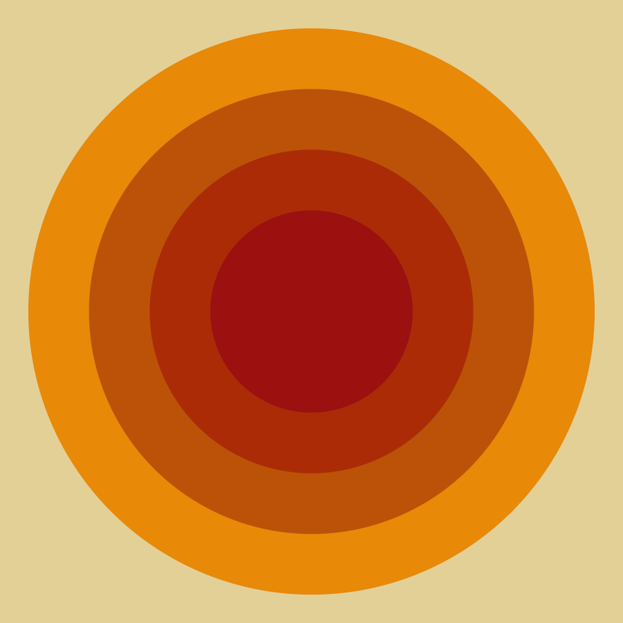
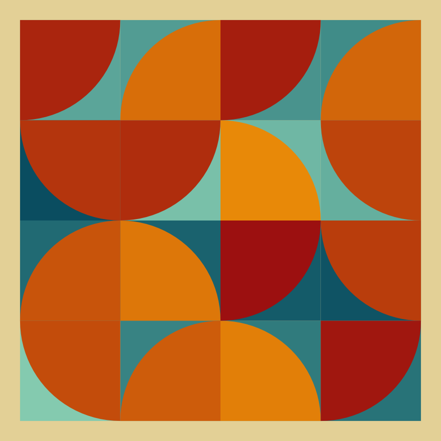
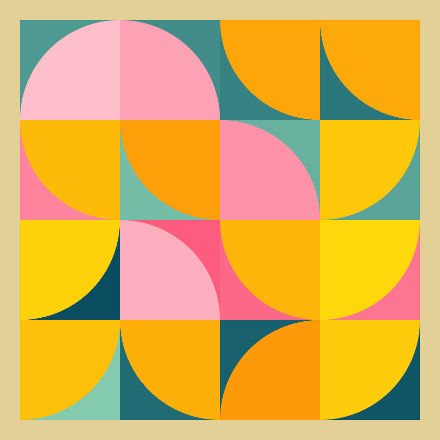

variations on a theme
================

<!-- badges: start -->

<!-- badges: end -->

This repository contains code I’ve used to create art using R
[(#rtistry)](https://twitter.com/search?q=%23rtistry&src=typed_query).
As the title suggests, I start by choosing a theme and then explore
different outputs until I’m satisfied. By the nature of this process,
the code in this repository will always be a work in progress. The
images below are examples of outputs from the code included here.

You are welcome to use this code to recreate the outputs, or as a
starting point for writing your own code to create more art. If you
enjoy this and would like to let me know, or have any questions, please
get in contact [@ShandiyaB](https://twitter.com/ShandiyaB).

### radial

### bauhaus

### twirly-whirly

